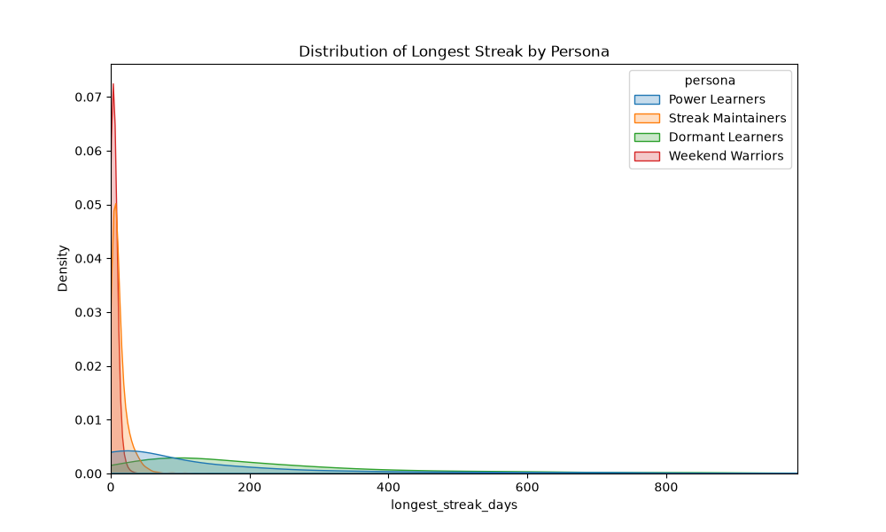
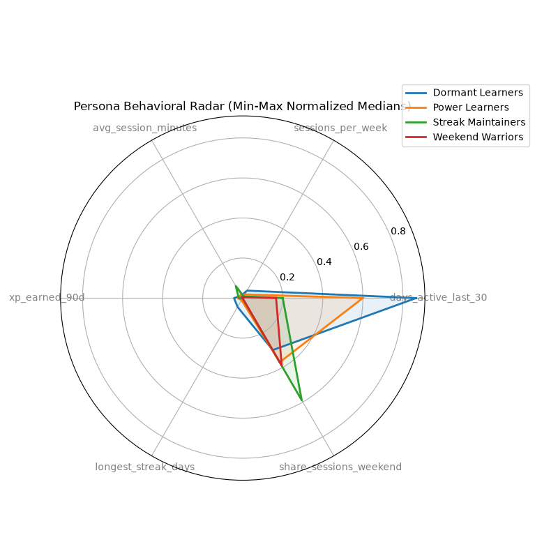
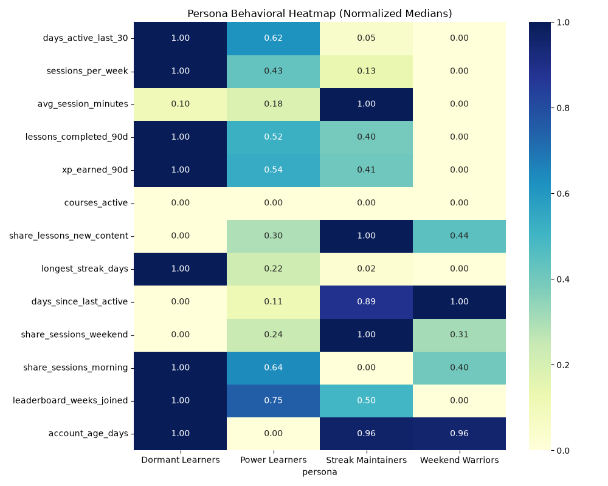
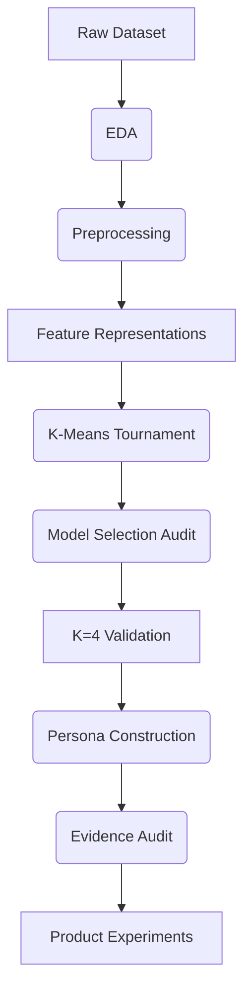

# 🎓 Learner Personas

Behavioral learner segmentation using unsupervised machine learning to discover actionable learner personas.


---

## 📊 Key Result Card

| Metric | Result |
| --- | --- |
| Learners | 6,000 |
| Features | 18 raw |
| Final representation | `behavior_robust` |
| Algorithm | K-Means |
| Clusters | 4 |
| Personas | 4 |
| Tests | 21 passed |

---

## 📸 Persona Snapshot

| Persona | Population | Percentage | Behavioral Signature |
| --- | --- | --- | --- |
| 💤 **Dormant Learners** | 2,228 | 37.1% | Minimal recent engagement and elevated periods of inactivity. |
| 🔥 **Streak Maintainers** | 1,638 | 27.3% | High login frequency and long consecutive active days, coupled with shorter average session durations. |
| 🌤️ **Weekend Warriors** | 1,571 | 26.2% | Concentrate a large majority of their learning activity on weekends. |
| ⚡ **Power Learners** | 563 | 9.4% | Massive learning volume, exceptionally high XP accumulation, and active leaderboard participation. |

---

## 🎯 Problem Statement

Educational platforms serve thousands of learners, each with highly varied engagement patterns. The goal of this project is *not* predictive modeling (e.g., predicting churn), but rather **discovering meaningful behavioral segments** that can support differentiated product strategies. 

Clustering is appropriate here because it allows the data to organically reveal natural behavioral groupings (personas) without imposing biased demographic or pre-conceived psychological boundaries.

---

## 📂 Dataset

The raw dataset captures the learning behavior of real users. 
**Importantly, the raw dataset is strictly read-only and is never modified during the pipeline.**

- **Size**: 6,000 learners
- **Shape**: 18 columns
- **Timeframe**: 2023-01-01 → 2025-06-19
- **Demographics**: 8 countries
- **Tech context**: 3 platforms, 2 subscription types, 2 notification states
- **Quality**: 93 missing values in `avg_session_minutes`, 0 duplicate rows, 0 duplicate learner IDs

---

## ⚙️ Feature Engineering

| Feature | Transformation | Purpose |
| --- | --- | --- |
| `account_age_days` | Derived from `signup_date` | Establish baseline account tenure |
| Missing Indicator | Binary flag (`avg_session_minutes`) | Retain behavioral signal of no sessions |
| Normalization | `Log1p` | Compress heavily skewed volume variables (XP, lessons) |
| Scaling | `RobustScaler` | Prevent extreme outliers (power learners) from skewing clustering geometry |

We ran explicit experiments comparing `StandardScaler` (behavior_standard) vs `RobustScaler` (behavior_robust), and evaluated categorical inclusions. `behavior_robust` provided the most stable segmentation resistant to extreme outliers.

---

## 🧠 Model Selection

The project utilized a rigorous K-Means clustering tournament evaluating K=2 through K=10.

- **Initial Heuristic Bias**: K=2 initially appeared strongest because stability metrics (like ARI) heavily favor binary splits (e.g., Active vs Inactive).
- **The Audit**: A secondary manual audit proved that K=2 collapsed highly distinct engaged users (Power vs Streak vs Weekend) into a single monolithic group, defeating the product goals.
- **Final Selection**: **`behavior_robust` + KMeans + K=4**. This combination achieved near-perfect stability (ARI ~0.9998) across seeds and extracted highly actionable, balanced business segments. We accept the slight drop in Silhouette score compared to K=2 as a necessary tradeoff for granular product usefulness.

---

## 🎨 Persona Visuals

*(Visualizations generated deterministically from the final pipeline)*

<details>
<summary>Click to view Persona Distribution</summary>

</details>

<details>
<summary>Click to view Behavioral Radar Chart</summary>

</details>

<details>
<summary>Click to view Feature Heatmap</summary>

</details>

---

## 👥 Persona Details

### 💤 Dormant Learners (37.1%)
- **Observed behavior**: Show very low recent activity and substantially higher days since last active. Median days active last 30 is 0.
- **Key evidence**: Extremely low `days_active_last_30` and `sessions_per_week`.
- **Potential product opportunity**: Push notifications with one-tap, highly simplified "refresher" content could safely re-engage users without overwhelming them.

### 🔥 Streak Maintainers (27.3%)
- **Observed behavior**: Exhibit frequent activity and unusually long streaks while maintaining relatively short sessions.
- **Key evidence**: Massive standardized effect size on `longest_streak_days`.
- **Potential product opportunity**: 1-minute "rapid review" modules or micro-lessons to support consistent engagement on busy days.

### 🌤️ Weekend Warriors (26.2%)
- **Observed behavior**: Concentrate their activity into fewer, longer sessions, mostly on weekends.
- **Key evidence**: Exceptionally high `share_sessions_weekend`.
- **Potential product opportunity**: Weekly progress goals may fit this behavior far better than restrictive daily streaks.

### ⚡ Power Learners (9.4%)
- **Observed behavior**: Exhibit substantially higher learning volume, XP accumulation, and leaderboard participation.
- **Key evidence**: Top decile across all volume and intensity metrics (XP, lessons, courses active).
- **Potential product opportunity**: Elite leaderboard tiers or advanced course tracks to increase long-term retention for highly active users.

---

## 🧪 Product Strategy

*(These are proposed experiments, not validated causal effects.)*

| Persona | Observed Behavior | Potential Need | Hypothesis | Experiment |
| --- | --- | --- | --- | --- |
| **Weekend Warriors** | High weekend session share. | Flexible scheduling without weekday penalty. | Weekly progress goals will reduce churn vs daily streaks. | A/B test Weekly vs Daily progress tracking. |
| **Dormant Learners** | Elevated inactivity; zero recent sessions. | Low-friction return experience. | 1-minute "rapid refresher" content removes friction. | A/B test push notifications for 1-tap refreshers. |
| **Streak Maintainers** | Long streaks but short sessions. | Ability to maintain streak on low-capacity days. | Micro-lessons (1-2 min) support streak continuation. | A/B test introducing rapid review modules. |
| **Power Learners** | Exceptional XP & volume. | Advanced content & deeper progression. | Elite tiers will prevent boredom and extend LTV. | A/B test unlocking a "Diamond League". |

---

## 🔄 Pipeline Diagram



---

## 🚀 Reproducibility

The repository is built for 100% determinism.

1. **Clone the repo:**
   ```bash
   git clone https://github.com/sadiyasyed28/Learner-Personas.git
   cd Learner-Personas
   ```
2. **Environment:** Create a virtual environment and install requirements:
   ```bash
   pip install -r requirements.txt
   ```
3. **Dataset:** Place the raw production dataset at the required location (dataset is not tracked in git due to data privacy policies).
4. **Run tests:**
   ```bash
   pytest tests/
   ```
5. **Run pipelines:** You can safely execute the Python scripts in `src/` to regenerate the identical models, reports, and PNG visualizations.

---

## 📁 Project Structure

```text
Learner-Personas/
├── data/
│   ├── processed/      # Preprocessed feature representations
│   └── outputs/        # Generated clusters, plots, evidence profiles
├── reports/
│   ├── final/          # Complete audit reports
│   ├── modeling/       # Clustering evaluation metrics
│   ├── personas/       # Extracted personas & summaries
│   └── product/        # Experiment specifications
├── src/                # Core ML pipeline and generation scripts
├── tests/              # 21 Pytest validations
├── requirements.txt    # Project dependencies
└── README.md
```

---

## ⚠️ Limitations

- **Observational Data**: This dataset captures observation behavior; clustering does not prove causality.
- **Behavioral, Not Psychological**: Personas are purely behavioral segments. We do not make claims about underlying motivations, demographics, or intelligence.
- **K=4 is a Business Choice**: While stable, K=4 is an analytical choice balancing mathematical separation and product usefulness.
- **Hypothesis Testing Required**: The proposed product interventions require rigorous A/B experimentation to validate causal effects on retention.
- **Population Constraints**: The dataset is a point-in-time snapshot and may not generalize to future cohorts without pipeline retraining.

---

## ✨ Technical Highlights
- 100% reproducible preprocessing pipelines.
- Robust handling of extreme outliers via median/IQR scalers.
- Rigorous clustering tournament evaluating multiple feature permutations across K=2..10.
- Deep model selection audit combating heuristic stability bias.
- Strict evidence-based persona construction avoiding inferential leaps.
- Fully automated Pytest suite asserting mathematical logic and output integrity.
- Detailed A/B experiment spec translation for Product teams.
